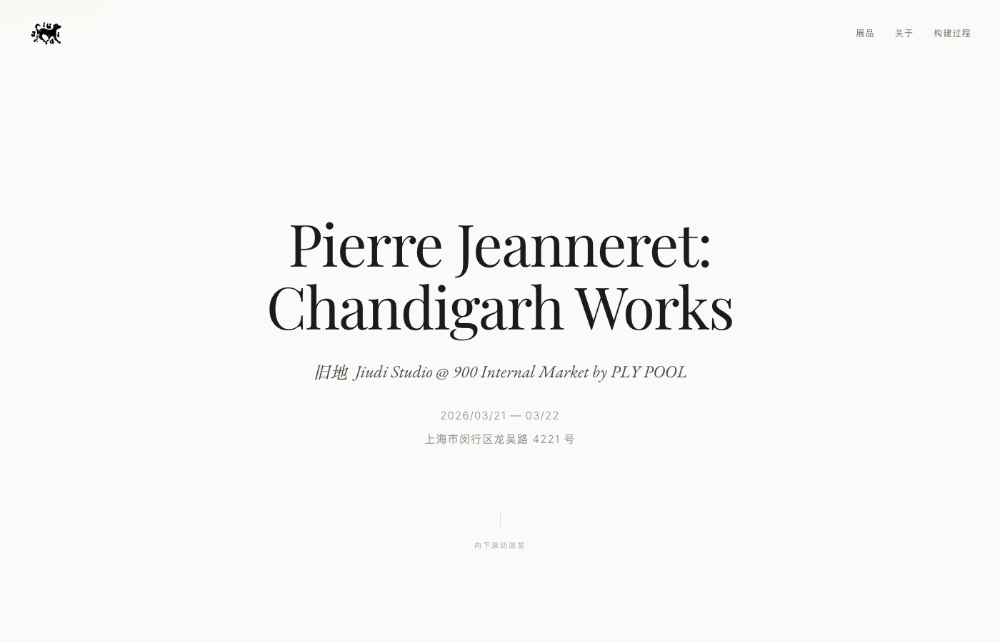
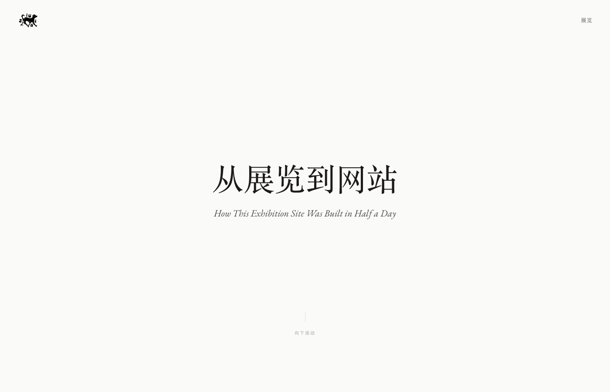
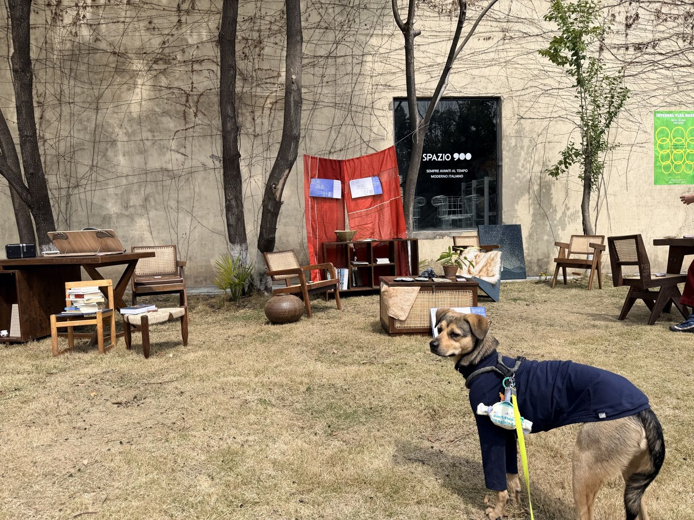

# exhibit-to-web

A Claude Code skill for rapidly converting offline exhibitions, pop-ups, and gallery shows into polished digital exhibition websites.

## What This Does

**exhibit-to-web** helps exhibition organizers, gallery owners, and event curators create beautiful digital versions of their physical shows — in half a day or less. It uses a design-first approach: before writing any code, it guides you through establishing the visual identity, narrative, and information architecture of your exhibition.

A website is itself a form of exhibition. Physical space has a deadline; digital space does not.

### Live Example

This skill was born from a real project — a two-day Pop-up Exhibition of Pierre Jeanneret's Chandigarh furniture in Shanghai:

| Exhibition Site | Behind-the-Scenes Guide |
|-----------------|------------------------|
| [](https://jiudi-pop-up-exhibition.vercel.app) | [](https://jiudi-pop-up-exhibition.vercel.app/guide.html) |
| [View Exhibition →](https://jiudi-pop-up-exhibition.vercel.app) | [View Guide →](https://jiudi-pop-up-exhibition.vercel.app/guide.html) |


*Pierre Jeanneret: Chandigarh Works — 900 Internal Market by PLY POOL, Shanghai, 2026/03/22*

### Key Features

- **Design-First Workflow** — Establishes visual direction, typography, color, and spacing before touching code. Uses [impeccable.style](https://impeccable.style/) principles to avoid generic AI aesthetics.
- **Zero Dependencies** — Single HTML files with inline CSS/JS. No npm, no build tools, no frameworks. A single file that will work in 10 years.
- **Multi-Agent Research** — Uses parallel AI agents to cross-reference exhibition content (dates, provenance, artist info) from multiple sources. Human review remains the final checkpoint.
- **Rapid Deployment** — GitHub + Vercel auto-deploy pipeline. Push code, live in seconds. Critical when on-site photos arrive hours before opening.
- **China-Ready** — Cloudflare CDN integration, ICP filing guidance, image optimization for mobile audiences accessing via WeChat.

## Installation

### For Claude Code Users

Clone directly to your skills directory:

```bash
git clone https://github.com/Yaxuan42/exhibit-to-web.git ~/.claude/skills/exhibit-to-web
```

Or copy manually:

```bash
mkdir -p ~/.claude/skills/exhibit-to-web
cp SKILL.md ~/.claude/skills/exhibit-to-web/
```

## Usage

### Start a New Exhibition Site

```
> I have a pop-up exhibition this weekend, 12 pieces of mid-century furniture. I need a website.
```

The skill will:
1. **Brief** — Ask about the exhibition, its narrative, available content, and audience
2. **Design** — Propose aesthetic directions, define typography/color/spacing, confirm a design brief
3. **Build** — Create a single-file HTML site with responsive design and scroll-triggered reveals
4. **Deploy** — Guide you through GitHub → Vercel → domain → CDN setup

### Convert an Existing Exhibition

```
> 我上周办了个摄影展，有照片和文字说明，想做成线上展览
```

Same workflow, adapted for post-event archival. The skill adjusts its questions based on whether the exhibition is upcoming or already happened.

## Four-Phase Workflow

```
BRIEF   → Ask, listen, synthesize, confirm
            ↓
DESIGN  → Aesthetic direction → Design tokens → Anti-patterns → Design brief
            ↓
BUILD   → Page structure → Implementation → Content population → Refinement
            ↓
DEPLOY  → Git → Vercel → Domain → CDN → Live
            ↓
          Iterate (on-site photos, copy refinements, human review)
```

| Phase | Human Effort | AI Effort | Output |
|-------|-------------|-----------|--------|
| Brief | High — articulate the narrative | Low — structured questions | Exhibition Brief |
| Design | High — aesthetic judgment | Medium — propose options | Design Brief |
| Build | Low — review and refine | High — write all code | Single-file HTML |
| Deploy | Low — configure accounts | High — automate pipeline | Live site |

## Design Philosophy

This skill was born from a specific belief:

1. **When AI makes coding free, design becomes the differentiator.** Anyone can generate a website. The question is whether it has the same atmosphere as the physical exhibition it represents.

2. **Anti-AI-Slop.** Dark backgrounds with cyan gradients, glassmorphism, neon accents — these are the visual equivalent of stock photography. Exhibition sites should feel like gallery spaces, not SaaS landing pages.

3. **Single files are forever.** A React project from 2019 needs archaeology to run. A single HTML file opens in any browser, any decade.

4. **Human review is not optional.** AI can research, but internet information about art and design objects is inconsistent across publications, auction records, and museum databases. A knowledgeable human must verify before publishing.

## Deployment Stack

| Tool | Role |
|------|------|
| [GitHub](https://github.com) | Code versioning |
| [Vercel](https://vercel.com) | Auto-deploy from git push |
| [Cloudflare](https://cloudflare.com) | CDN, DNS, China access optimization |
| [Claude Code](https://claude.ai/claude-code) | AI-assisted development |
| [impeccable.style](https://impeccable.style/) | Design quality prompting |

## Requirements

- [Claude Code](https://claude.ai/claude-code) CLI (or any AI coding agent that supports skills)
- A GitHub account and a Vercel account (both free tier)
- Exhibition content: photos + text descriptions

## Credits

Created by [@Yaxuan42](https://github.com/Yaxuan42) with Claude Code.

Built during a real exhibition: *Pierre Jeanneret: Chandigarh Works* by Jiudi Studio, Shanghai, March 2026. The guide page and this skill were created en route to the venue — Tesla Autopilot + [Typeless](https://typeless.ch/) voice input + Claude Code, at 77 km/h.

## License

MIT — Use it, modify it, share it.
